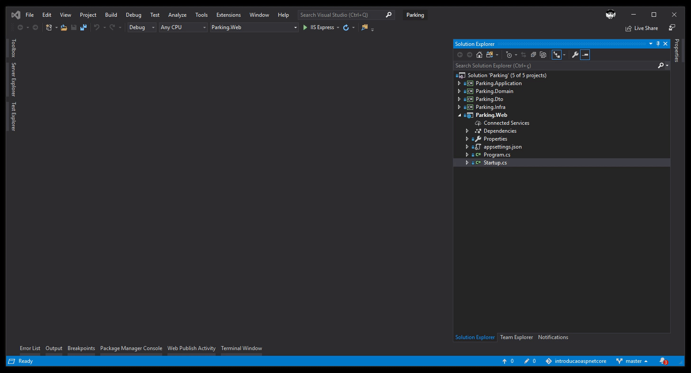
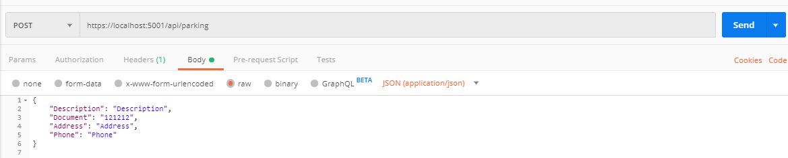

# Bem vindos ao .Net Core!

Público alvo desse treinamento:

* Iniciantes em .Net Core
* Dev's de outra linguagem e que desejam aprender uma nova tecnologia

Após esses encontros:

* Vamos criar uma API básica com entity framework core e SQL

### API

API ou Application Programming Interface é um padrão de comunicação entre aplicações consolidado no mercado e com diversos benefícios.
O Open Bank Project API por exemplo, hoje conta com mais de 15k API's publicadas.

### Middlewares

Para continuidade do nosso projeto vamos aplicar o conceito de Middlewares, que nada mais é do que um software que se encontra entre o sistema operacional e os aplicativos nele executados.
Uma boa analogia é a do encanamento, onde podemos definir que entre o request e o response de nossa aplicação tudo o que for adicionado é um middleware.

No .Net Core esse "encanamento" é vazio (selecionamos um modelo vazio no momento de criação de nosso projeto web).

### MVC

Tambem aplicaremos o padrão MVC na nossa aplicação. Podemos definir MVC como um padrão para organizar nosso projeto, ele não é uma linguagem ou um framework e várias outras linguagens aplicam esse conceito.  

1. Para iniciar no .Net Core devemos instalar o pacote abaixo na sua Api (Parking.Web):

PM> Install-package Microsoft.AspNetCore.Mvc  

2.  O próximo passo é incluir esse middleware na nossa aplicação.

* Na sua classe Startup no método ConfigureServices adicione:

`services.AddMvc().SetCompatibilityVersion(CompatibilityVersion.Version_2_2);`

* Na sua classe Startup no método Configure adicione:

`app.UseMvc();`

3. Nesse momento vamos criar nosso primeiro Controller, que será a classe responsável por disponibilizar nossa rota de acesso a API. 

### Verbos

Os verbos terão um papel importante na nossa aplicação e devemos entender esse conceito e as possibilidades disponíveis. A idéia resumidamente é prover uma url base e indicar através dos verbos qual ação está sendo requisitada.

* GET - Usado para recuperar dados do serviço
* POST - Usado para criar uma nova instância de dados no serviço
* PUT - Usada para atualizar uma instância existente no serviço
* DELETE - Remover uma instância do serviço

1. Crie o método Create no nosso Controller em conjunto com o verbo POST, e passe por parâmetro nossa entidade Parking para o mesmo.

### DDD

Nesse momento é necessário entender o conceito de DDD e o motivo pelo qual foi definida essa arquitetura para o nosso projeto. Resumidamente DDD é uma abordagem de modelagem de software que segue um conjunto de práticas com objetivo de facilitar a implementação de complexas regras / processos de negócios que tratamos como domínio.

* DDD não é uma arquitetura de camadas! (Apesar de utilizarmos várias).

Os pilares básicos do DDD são:

* Negócio (Domain experts): Sem saber do negócio, não existe DDD.
* Linguagem Ubíqua: Linguagem do negócio dentro da empresa
* Estratégia: Entendimento e visão do negócio = segregar seus domínios
* Tática: Modelar e implementar os comportamentos do negócio

### Camada de aplicação (Application)

Entendendo basicamnete o conceito de DDD e de nossa arquitetura, podemos seguir com a criação da nossa camada Application. Elas será responsável por coordenar a execução de alguma tarefa da nossa aplicação, após identificar ela delega essa tarefa para os objetos de domínio de uma camada inferior.

1 . Criar a Interface do Application - IParkingAppService  

2 . Criar a implementação - ParkingAppService  

### Injeção de dependência

Basicamente, são os serviços utilizados por uma uma aplicação.
Eles podem ser adicionados de três maneiras:

* Transient: São criados cada vez que são solicitados pelo contêiner.
* Scoped: Criados uma vez por solicitação do cliente
* Singleton: Criado na primeira solicitação e reutilizado.

1. Vamos criar a classe ServiceCollectionExtensions no projeto Parking.Application, crie nela um método estático chamado AddApplication, essa classe será responsável por adicionar nossos serviços em outras camadas.

2. Adicione a Interface e a implementação de todos os nossos AppServices como Transient.

3. Crie a mesma classe no projeto Parking.Domain com um método estático chamado AddDomain.

4. Adicione o nosso contexto como Scoped.

5. Adicione no Startup nossos métodos AddDomain() e AddApplication().

### Implementando o Create

1. Adicione por injeção de dependência a camada de application no nosso Controller.

2. No nosso projeto de domínio (Parking.Domain) vamos implementar nosso Service, para isso:  

    2.1.  Criar a interface do DomainService - IParkingDomainService  
  
    3.2.  Criar a implementação - ParkingDomainService  
  
3. Implemente o método Create no AppService, para isso, adicione a camada de Domain por injeção de dependência.

### Postman

Instale o postman, disponível em: https://www.getpostman.com/downloads/

Em seguida envie a requição de inserção e verifique o registro no seu banco de dados.

No próximo encontro vamos trabalhar com:

* DTO
* Fail Fast Validations
* Repository Pattern
* LINQ/LAMBDA
* Dapper
  
  
 

