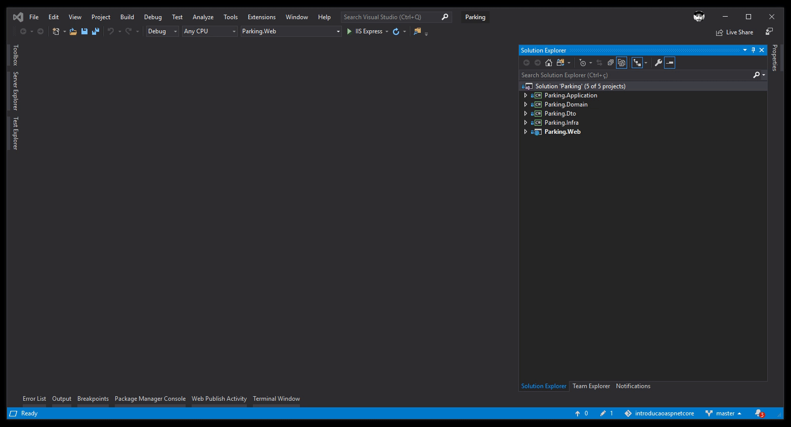
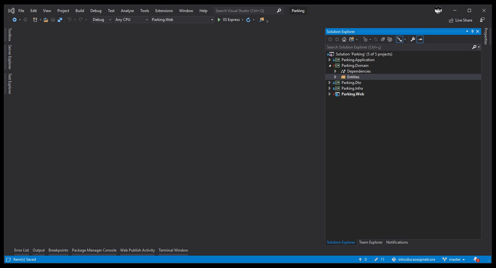
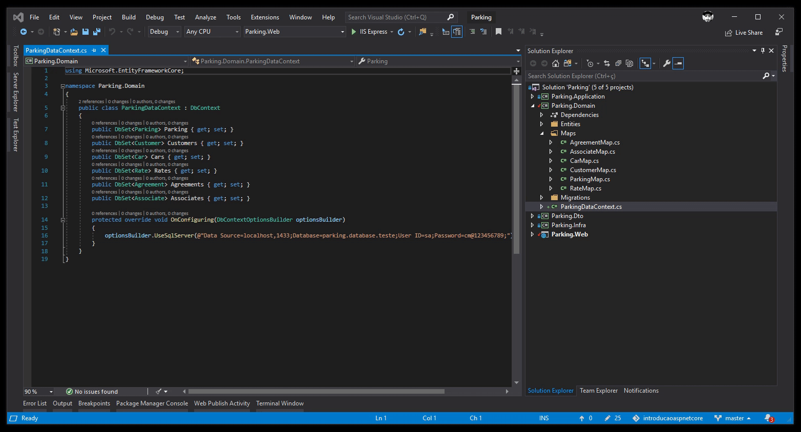

# Bem vindos ao .Net Core!

Público alvo desse treinamento:

* Iniciantes em .Net Core
* Dev's de outra linguagem e que desejam aprender uma nova tecnologia

Após esses encontros:

* Vamos criar uma API básica com entity framework core e SQL

### Entity Framework Core

O Entity Framework Core é uma solução de ORM (Mapeamento Objeto Relacional) que basicamento, realiza o dê-para de suas entidades para suas tabelas no Banco de Dados.

1. Para iniciar sua instação, acesse o Package Manager Console e digite o comando de instalação do pacote e em seguida a instação do provider para SQL SERVER:

PM> Install-Package Microsoft.EntityFrameworkCore  
PM> Install-Package Microsoft.EntityFrameworkCore.SqlServer

  
2. Agora vamos criar as nossas entidades no projeto Parking.Domain:

* Agreement | Associate | Car | Customer | Parking | Rate
 
3. Ainda em Parking.Domain, vamos criar o DataContext - que será a nossa representação do Banco de dados no projeto:
 
* ParkingDataContext
 
Nesse projeto vamos utilizar o Code-First (introduzido no Entity Framework 4.1), com isso teremos um controle maior (há nível de código-fonte) ou seja, nossas classes (entidades criadas acima) são codificadas primeiro e em seguida geramos o banco de dados necessário para persistir os dados. 
 
 

4. Nesse ponto vamos atualizar nosso banco de dados a partir das entidades geradas com os comandos:
 
PM> dotnet ef migrations add initial --project .\Parking.Domain --startup-project .\Parking.Web  
PM> dotnet ef database update --project .\Parking.Domain --startup-project .\Parking.Web  

  

5. Podemos verificar que as tabelas foram geradas com os nomes pluaralizados e alguns campos talvez não atendam a necessidade do negócio e que podem influenciar na performance da nossa aplicação. 
Para resolver esse problema podemos usar os arquivos de Map, ainda no projeto Parking.Domain

* AgreementMap | AssociateMap | CarMap | CustomerMap | ParkingMap | RateMap

5. Após a criação dos arquivos, vamos acrescentar os mesmos no nosso DataContext.
6. Por último vamos gerar uma nova versão do Migration e aplicar as atualizações de Bando de Dados definidas.

PM> dotnet ef migrations add v2 --project .\Parking.Domain --startup-project .\Parking.Web  
PM> dotnet ef database update --project .\Parking.Domain --startup-project .\Parking.Web

No próximo encontro vamos trabalhar com:

* Criação da API
* DDD
* Rotas e CRUD
  
  
 

