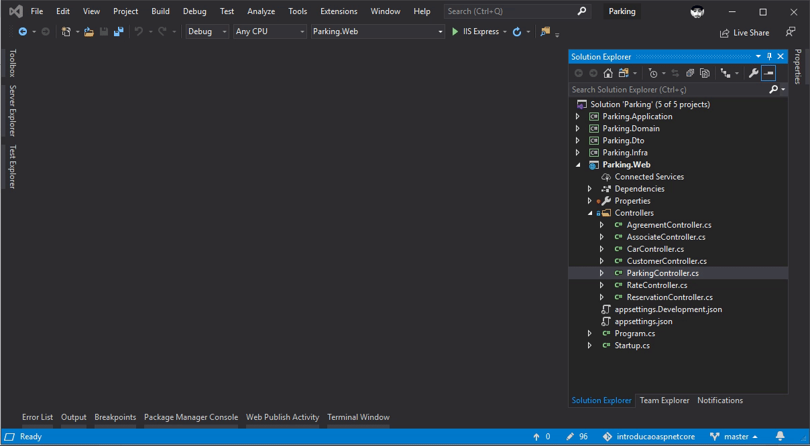

# Bem Vindos ao .Net Core!

Público alvo desse treinamento:

* Iniciantes em .Net Core
* Dev's de outra linguagem e que desejam aprender uma nova tecnologia

Após esses encontros:

* Vamos criar uma API básica com entity framework core e SQL

### Cache

Existem várias estratégias de chache tanto para backend quando o frontend, nesse tópico vamos abordar a padrão da Microsoft.  O cache pode melhorar significativamente o desempenho e a escalabilidade de um aplicativo, reduzindo o trabalho necessário para gerar o seu conteúdo.  


  
### Compressão  
  
Resumidamente, vamos otimizar nossas respostas e aumentar a capacidade e compactando as mensagens.
  
1. Primeiramente precisamos instalar o pacote específico:

PM> Install-Package Microsoft.AspNetCore.ResponseCompression

2. Adicione no Startup:  
  
_services.AddResponseCompression();_
_app.UseResponseCompression();_  
  
### Documentação  
  
Para disponibilizar os métodos da sua API podemos utilizar o Swagger, o setup é bastante simples e pode ser feito da seguinte maneira:

1. Instale o pacote do Swagger

PM> Install-Package Swashbuckle.AspnetCore

2. Adicione no Startup os seguintes métodos:  
  
```
services.AddSwaggerGen(x =>
{
    x.SwaggerDoc("v1", new Info { Title = "Parking API", Version = "v1" });
});
```
```
app.UseSwaggerUI(c =>
{
    c.SwaggerEndpoint("/swagger/v1/swagger.json", "Parking API");
});
```  
  
Em seguida acesse o endereço: htttp://{endpoint}{port}/swagger  
  

  
### Versionamento  
  
Essa estratégia é necessária por exemplo para controlar e disponibilizar o acesso a diferentes apps e facilita a evolução de sua aplicação sem a geração de 'breaking-changes' no seu ambiente.  
  
### GIT

O Git é um sistema  de controle de versões ditribuídos, com ele é possível controlar o histórico de alterações de qualquer arquivo e pode ser utilizado por todos que cumpram os requisitos da licença GNU.

1. Para iniciar instale o GIT:  
* http://git-scm.com/download/mac - MAC
* http://msysgit.github.io/ - WINDOWS
* http://book.git-scm.com/2_installing_git.html - LINUX

2. Crie uma nova pasta e execute o comando para criar um novo repositório:
*  _git-init_  

2. Para obter um repositório execute o comando:
* _git clone /caminho/para/o/repositório_

Seus repositórios locais consistem em três "árvores" mantidas pelo git. a primeira delas é sua Working Directory que contém os arquivos vigentes. a segunda Index que funciona como uma área temporária e finalmente a HEAD que aponta para o último commit (confirmação) que você fez.


1. Para adicionar comandos ao Index execute o comando:  
* _git add <arquivo>_ ou
* _git add_ *
        
2. Para confirmar as mudanças e enviar suas alterações para o HEAD é necessário executar o comando de commit:  
* _git commit -m "comentários das alterações“_ *

3. O último passo e enviar as alterações para o seu repositório remoto:
* _git push origin master_

Podemos utilizar o conceito de Branchs quando for necessário desenvolver funcionalidades isoladas uma das outras.
Para criar sua branch execute o comando:  


* _git checkout -b funcionalidade_x_

### Publish
: TODO

### Monitoramento
: TODO

Desse momento em diante já é possível partir para a criação da nossa aplicação de front, para integrar com nossa API e ao final desse desenvolvimento teremos nosso MVP.
     
.
