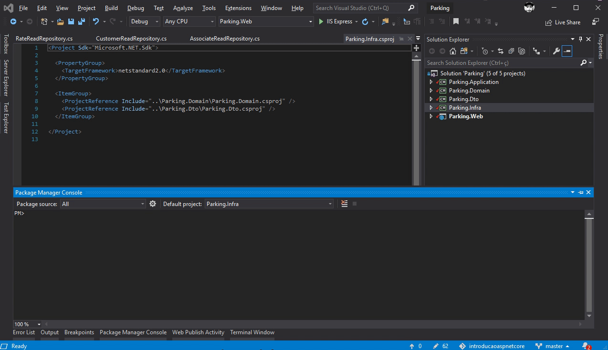
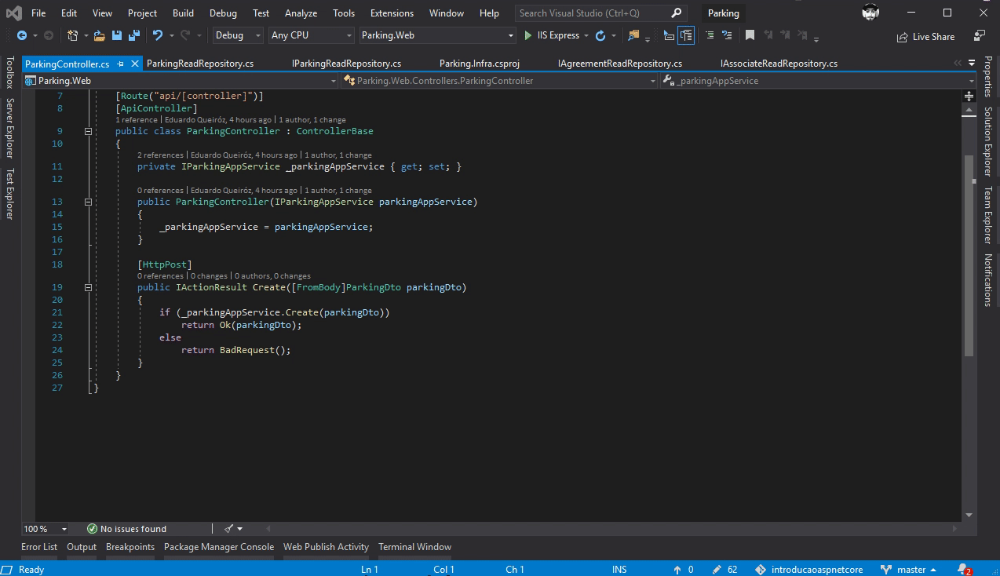
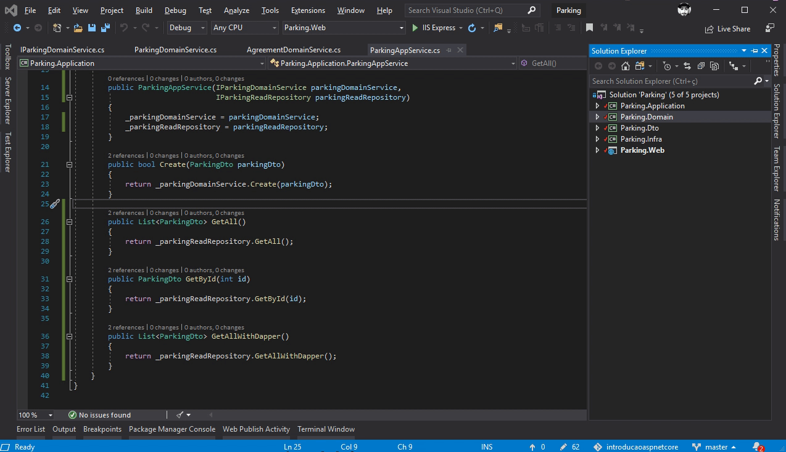
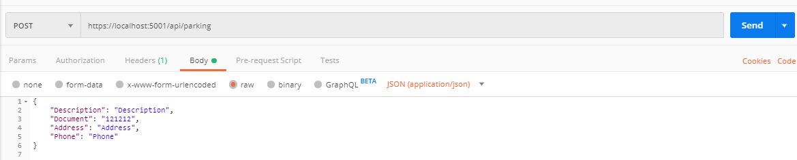

# Bem Vindos ao .Net Core!

Público alvo desse treinamento:

* Iniciantes em .Net Core
* Dev's de outra linguagem e que desejam aprender uma nova tecnologia

Após esses encontros:

* Vamos criar uma API básica com entity framework core e SQL

### Cache

Existem várias estratégias de chache tanto para backend quando o frontend da sua aplicação, nesse tópico vamos abordar a padrão da Microsoft. Utilizando o mesmo podemos melhorar:

* Não expõe sua entidade
* Oculta propriedades específicas que os clientes não devem exibir.
* Reduz os tamanhos dos objetos
* Desacopla sua camada de serviços da camada de banco de dados.

1. Primeiramente vamos criar todos os objetos Dto's que representam nossas entidades: 

* AgreementDto | AssociateDto | CarDto | CustomerDto | ParkingDto | RateDto

2. O próximo passo é substituir no nosso Controller (Projeto Parking.Web) a classe que representa a entidade pelo nosso Dto.
3. Em seguida substitua nas camadas subsequentes (Parking.Application e Parking.Domain)

### Fail Fast Validation

Nesse ponto, caso algum usuário de nossa API envie dados incompletos ou incorretos a validação ocorre apenas na camada de domínio, no momento em que os dados forem persistidos no banco de dados.
Para evitar isso vamos utilizar o pacote FluentValidation, ele pode ser intalado no pacote Parking.Dto com o seguinte comando:

PM> Install-Package FluentValidation

1. Crie as validações necessárias para cada Dto, existem diversas validações disponíveis e elas podem ser consultadas em: https://fluentvalidation.net/built-in-validators

* AgreementValidator | AssociateValidator | CarValidator | CustomerValidator | ParkingValidator | RateValidator

2. Instale no projeto Parking.Web o pacote FluentValidation.AspNetCore

PM> Install-Package FluentValidation.AspNetCore

3. Adicione os serviços no Startup.cs com o _.AddFluentValidation()_
4. Na classe ServiceCollectionExtensions do projeto Parking.Domain adicione as validações criadas.

### Repository Pattern

O Repository Pattern é um padrão de projeto que auxiliará para evitar que ocorra um grande acoplamento entre nossas classes e também:

* Encapsula o acesso ao Banco de dados
* Permite a troca do SGDB sem afetar a aplicação
* Evita a duplicidade de código

1. Para iniciar crie o projeto Parking.Infra 
2. Crie a interface IParkingReadRepository com os métodos

        List<ParkingDto> GetAll();
        ParkingDto GetById(int id);

3. Implemente a classe ParkingReadRepository e os métodos da interface.
4. Crie a classe estática ServiceCollectionExtensions e diponibilize os repositórios no método _AddInfra()_ em seguida adicione o mesmo na classe Startup do seu projeto Parking.Web: _services.AddInfra();_

### Dapper

O Dapper é um micro-ORM que surgiu para resolver as consultar nem sempre tão performaticas de um ORM como o Entity Framework e as limitações do mesmo para alguns cenários.

1. Primeiramente vamos instalar o pacote do Dapper no projeto Parking.Infra

PM> Install-Package Dapper

2. Em seguida vamos criar o método _GetAllWithDapper_ nas nossas interfaces e repositórios

A documentação do Dapper pode ser acessada em: https://dapper-tutorial.net/dapper.  
Aqui é possível encontrar todas as possibildiades de consultas disponíveis ao se utilizar o pacote.

### API

1. Para finalizar vamos criar nossas rotas nos Controllers, para isso acesse o projeto Parking.Web e adicione os novos métodos _GetAll_, _GetById_, _GetAllWithDapper_ com o verbo _HttpGet_

2. Crie os métodos _GetAll_, _GetById_, _GetAllWithDapper_ na camada Application

3. Em seguida recupere o IParkingReadRepository por injeção de dependência e direcione as consultas para o repositório de leitura.

### Camada de aplicação (Application)

Por último vamos implementar o método de Delete no nosso Controller, na nossa camada de aplicação iremos delegar para a camada abaixo (Domain ou Infra) de acordo com a necessidade de nossa aplicações.

1. Vamos criar as rotas nos Controllers, para isso acesse o projeto Parking.Web e adicione o método _Delete_ com o verbo _HttpDelete_

2. Criar o métodos _Delete_ na camada Application

3. Nesse ponto nossa camada de Application irá delegar a consulta da nossa entidade para a camada de Infra e a deleção para a camada de Domain.

### Postman

Instale o postman, disponível em: https://www.getpostman.com/downloads/

Em seguida teste todas as requisições criadas até o momento no nosso projeto.

No próximo encontro vamos trabalhar com:

* Regras de negócio
* Cache
* Compressão
* Documentação
* Publicação
* Monitoramento
* Versionamento
    
     
.
 

